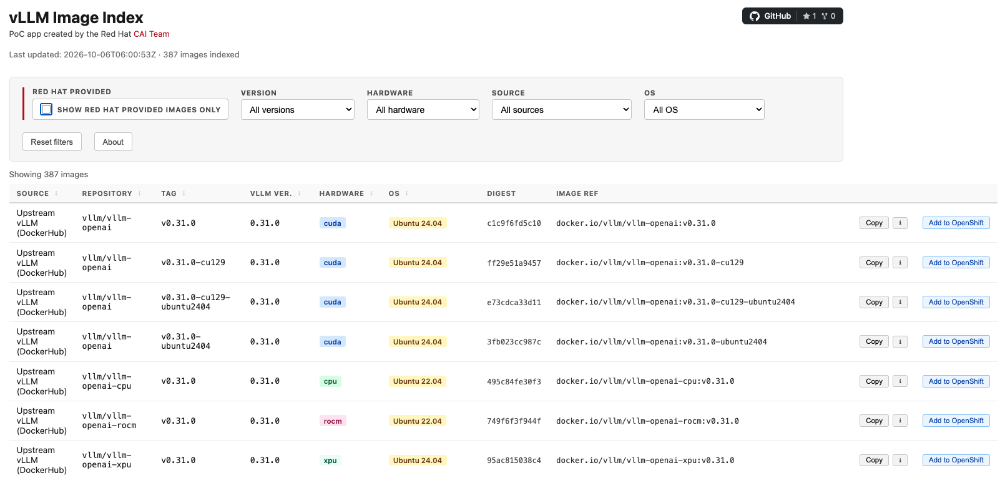

# vLLM Image Index — OpenShift Deployment

Kustomize-based deployment for the vLLM Image Index: a small web application that lists vLLM container images from Red Hat registries and DockerHub, updated daily by a CronJob.



## How it works

1. A CronJob (`vllm-fetch`) runs daily at 06:00 UTC. It calls `fetch.py`, which queries `registry.redhat.io` and DockerHub for vLLM image tags, resolves vLLM versions and OS details, and writes the result to `data.json`.
2. The CronJob patches the `vllm-image-data` ConfigMap via the Kubernetes API with the new `data.json`.
3. An nginx pod serves `index.html` and `data.json` from the ConfigMap, fronted by an OpenShift OAuth proxy for authentication.

## Directory structure

```
├── Containerfile            # Builds the fetch image (ubi9-minimal + python3 + skopeo)
├── kustomization.yaml       # Root kustomization — sets namespace, generates vllm-image-data ConfigMap
├── Makefile
├── app/
│   ├── fetch.py             # Registry scraper (run by the CronJob)
│   └── index.html           # Single-page frontend
├── base/
│   ├── kustomization.yaml
│   ├── cronjob.yaml         # Daily fetch CronJob
│   ├── deployment.yaml      # nginx + OAuth proxy
│   ├── service.yaml
│   ├── route.yaml           # TLS reencrypt route
│   ├── rbac.yaml            # Role/RoleBinding for the fetch ServiceAccount
│   ├── serviceaccount.yaml
│   └── nginx.conf
└── scripts/
    ├── deploy.sh            # Automated deploy: creates namespace, secrets, and applies kustomization
    └── entrypoint.sh        # CronJob entrypoint: seed cache → fetch → patch ConfigMap
```

## Building the fetch image

This image contains the Python logic that goes through the image registries and extracts the information that the frontend displays. An image is available publically on [Quay](https://quay.io/repository/rh-aiservices-bu/vllm-image-index), however if you want to push it into your own registry, the Containerfile and build commands are below.

```bash
podman build -f Containerfile -t quay.io/<your-org>/vllm-image-index-fetch:latest .
podman push quay.io/<your-org>/vllm-image-index-fetch:latest
```

Ensure you update the image reference in `base/cronjob.yaml` to match.

## Automated Deployment

Ensure you are logged in to your OpenShift cluster via the `oc` CLI, then run:

```bash
make deploy
```

The script will:

1. Create the namespace if it does not exist (default: `vllm-image-index`; override with `NAMESPACE=<name>`).
2. Check for each required Secret and prompt for credential file paths; only when missing. Example of the credential file is below.
3. Generate the OAuth cookie secret automatically.
4. Seed an empty `vllm-image-data` ConfigMap if absent.
5. Run `oc apply -k .`.
6. Trigger a one-off fetch Job if `vllm-image-data` is empty after deployment.

Re-running `make deploy` at any point is safe — all steps are idempotent.

### Credential file format

The script prompts for two `.dockerconfigjson` files:

**`registry.redhat.io`** — download from [the Red Hat Customer Portal](https://access.redhat.com/terms-based-registry/) (registry service account → "OpenShift Secret" → download):

```json
{
  "auths": {
    "registry.redhat.io": {
      "auth": "<base64-encoded-user:token>"
    }
  }
}
```

**DockerHub** — generate from `docker login` (`~/.docker/config.json`), or create one manually:

```json
{
  "auths": {
    "https://index.docker.io/v1/": {
      "auth": "<base64-encoded-user:password>"
    }
  }
}
```

If you do not have DockerHub credentials, leave the prompt blank and a placeholder will be used (unauthenticated pulls, subject to rate limiting).

## Manual Deployment

### Prerequisites

- An OpenShift cluster with the `oc` CLI configured
- The target namespace created (default: `vllm-image-index`)
- Two Secrets present in the namespace before deploying (see below)

### Required Secrets

Examples of the auth files can be found above in "Credential File Format" section.

#### `rh-registry-pull-secret`

A `.dockerconfigjson` credential for `registry.redhat.io`. The CronJob mounts this at `/mnt/auth/.dockerconfigjson`.

```bash
oc create secret generic rh-registry-pull-secret \
  --from-file=.dockerconfigjson=${PATH_TO_CONFIGJSON} \
  --type=kubernetes.io/dockerconfigjson \
  -n vllm-image-index
```

#### `dockerhub-pull-secret`

A `.dockerconfigjson` credential for DockerHub. The CronJob mounts this at `/mnt/dockerhub/.dockerconfigjson` and passes it to `fetch.py` via `--dockerhub-config`, allowing authenticated pulls to avoid rate limiting.

**The Secret must exist in the namespace** even if you do not have DockerHub credentials, because the CronJob volume mount references it unconditionally.

With credentials:

```bash
oc create secret generic dockerhub-pull-secret \
  --from-file=.dockerconfigjson=${PATH_TO_CONFIGJSON} \
  --type=kubernetes.io/dockerconfigjson \
  -n vllm-image-index
```

Without credentials (placeholder):

```bash
oc create secret generic dockerhub-pull-secret \
  --from-literal=.dockerconfigjson='{"auths":{}}' \
  -n vllm-image-index
```

#### `vllm-image-index-oauth-cookie`

A random cookie secret for the OAuth proxy.

```bash
oc create secret generic vllm-image-index-oauth-cookie \
  --from-literal=cookie-secret=$(openssl rand -base64 32) \
  -n vllm-image-index
```

The `vllm-image-index-proxy-tls` Secret is generated automatically by OpenShift's service serving certificate controller.

### Deploying

```bash
oc apply -k .
```

On first deploy the `vllm-image-data` ConfigMap contains an empty `data.json` placeholder. The index will show no images until the CronJob runs. To populate it immediately, trigger a manual run:

```bash
oc create job --from=cronjob/vllm-fetch vllm-fetch-manual -n vllm-image-index
```
